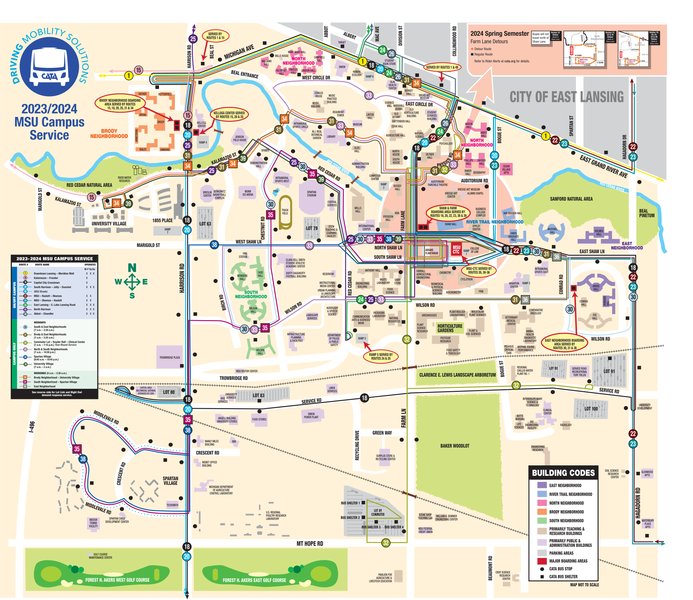
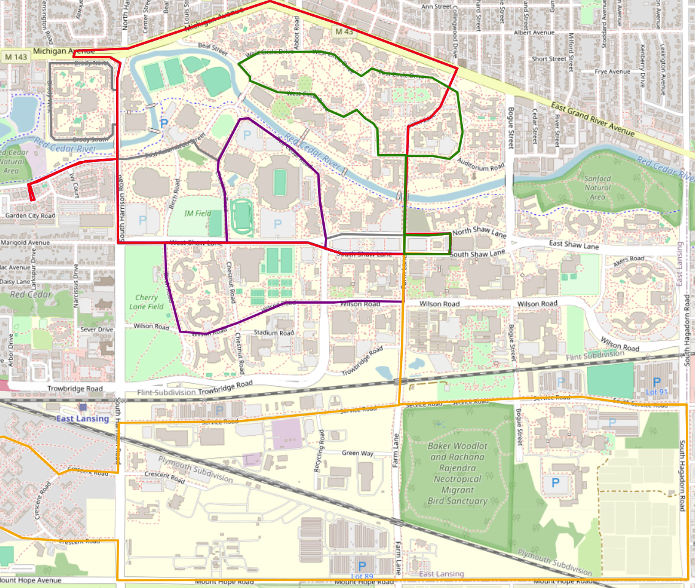

## Inspiration
From past experience with using the Michigan State University CATA Bus System, there are numerous inefficencies and the busses are very frequently late, overcrowded, or both.

## What our project does
We completely redesigned the bus system on campus including a reduction from the 10 current routes to 6 new routes, removing many areas of overlap in the existing bus routes, and adding bus stops at important locations that do not presently have them such as 1855 Place and the STEM Teaching and Learning Facility. Our project also automatically allocates a larger number of busses to high traffic routes at certain times based on the actual student needs.

## How we built it
Initially, we used the Folium Python library to create a map of East Lansing and draw our new bus routes, then we created a Python algorithm to generate a Pandas dataframe of 2,500 random students with class schedules and various extracurricular activites that they would need to use the bus system to travel to. This was a solig proof of conecpt, but we needed a better way to display the data and decided to create a custom website for it. The website can be found as the GitHub Pages link on this repo and features a few updates since the initial release. These updates include adding a dropdown menu to show which bus routes will be high traffic at a given hour, highlighting the routes on the map as they are needed, and using JavaScript to randomly generate the entire student population of 50,000 students every time the website loads rather than hard-coding the initial set f 2,500.

  
  

## What we learned
We learned about some critical aspects of the design process of public transportation as well as the importance of designing our code in a way that would accept various data sets to accomodate different needs of end users.

## What's next for Bus Route Project
We hope to be able to implement this and inspire some change in the MSU CATA Bus system so that busses are able to adequately serve students. Additionally we would hope to expand this to other college campuses and city bus systems globally. The final goal would be to implement a machine learning model to alter the routes themselves as needed and evaluate the success of each route over time.
